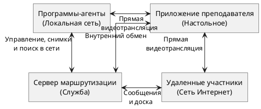

# 2.3 Проектирование архитектуры приложения

Разрабатываемая программная система «ClassControl» имеет модульную архитектуру, базирующуюся на смешанной сетевой структуре. Поскольку система должна обслуживать как локальных пользователей в классе, так и удаленных участников через сеть Интернет, классическая клиент-серверная модель была расширена прямыми соединениями для передачи тяжелого видеопотока.

Логически архитектуру системы можно разделить на четыре основных узла:
1. **Сервер маршрутизации Node.js.** Центральный узел системы, который физически запускается на компьютере преподавателя. Он отвечает за поддержание сетевых соединений, управление состояниями, включая текущий рисунок на доске, передачу сообщений и файлов.
2. **Модуль преподавателя.** Настольное приложение на базе Electron.js, предоставляющее графический интерфейс администратора. Управляет логикой проведения урока.
3. **Локальный агент.** Скрытое приложение, устанавливаемое на компьютеры учеников. Работает в фоне в области уведомлений. Использует встроенные функции системы для снимков экрана и подмены действий устройств ввода.
4. **Клиент для обозревателя.** Облегченное приложение для удаленных пользователей. Не требует установки, работает через обозреватель.

Общая схема взаимодействия модулей программной системы представлена на рисунке 2.1.

**Рисунок 2.1 — Архитектура программной системы «ClassControl»**

Информационный обмен между узлами системы строго разделен по типам трафика, что позволяет оптимизировать нагрузку на сеть:
* **Управляющие команды и телеметрия:** Подтверждение прав, отправка текстовых сообщений, синхронизация интерактивной доски, команды блокировки и ежесекундные миниатюры экранов передаются через постоянное двустороннее соединение. 
* **Служебный трафик:** Для того чтобы избавить преподавателя от ручного ввода сетевых адресов, применяется механизм широковещательных рассылок.
* **Мультимедийный трафик:** Полноэкранная трансляция экрана преподавателя, передача звука и сеансы демонстрации домашних экранов учеников реализуются через прямые соединения между узлами. 

Подобный архитектурный подход обеспечивает высокую надежность и масштабируемость: отказ отдельного локального агента не нарушает работу всей сети, а распределение мультимедийного трафика снижает требования к вычислительным мощностям компьютера преподавателя.